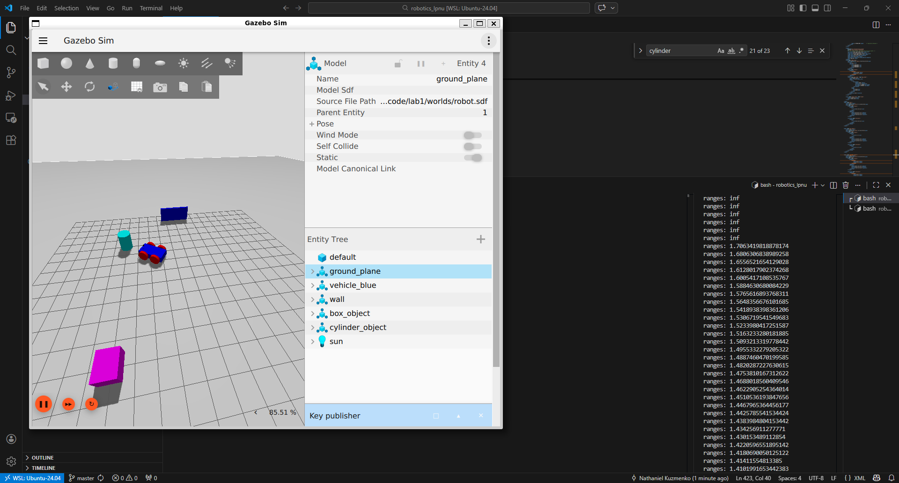

# Lab 1: Building Your Robot in Gazebo


## Learning Goals

1. Understand SDF format and structure
2. Create a four-wheeled mobile robot
3. Add a differential drive controller
4. Integrate a LiDAR sensor for environment sensing

---


## Testing Your Robot

```bash
# Enter Docker container
./scripts/cmd bash

# Launch Gazebo with your robot world
gz sim /opt/ws/src/code/lab1/worlds/robot.sdf

# In another terminal, list topics
gz topic -l

# Look at the lidar messages on the /lidar topic, specifically the ranges data
gz topic -e -t /lidar

# Send movement command (example)
gz topic -t "/cmd_vel" -m gz.msgs.Twist -p "linear: {x: 0.5}, angular: {z: 0.2}"
```


